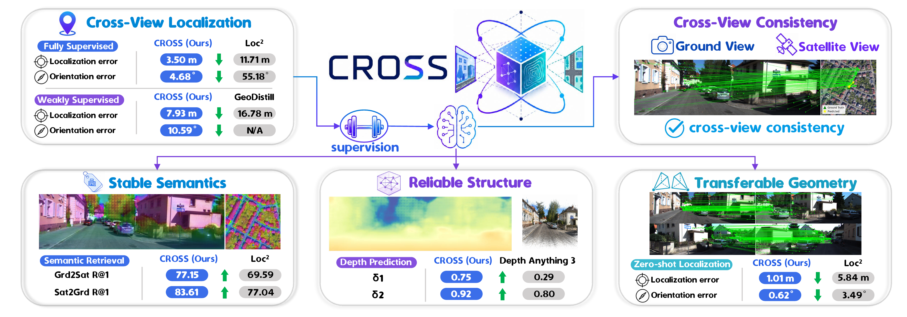

# More Than Where You Are: Learning Semantics, Structure, and Geometry from Cross-View Consistency

<p align="center">
  
</p>

<p align="center">
  <strong>CROSS</strong> learns stable semantics, reliable structure, and transferable geometry from cross-view consistency.
</p>

## ✨ Overview

This repository contains the training and evaluation code for CROSS on two cross-view localization benchmarks:

- **KITTI**: ground-view perspective images paired with satellite maps.
- **VIGOR**: ground-view panoramas paired with satellite maps.

CROSS uses DINO features as visual backbones and monocular depth maps as geometric guidance.

## 🛠️ Environment

The code has been tested with:

- Python 3.11.15
- PyTorch 2.6.0
- CUDA 12.4

Install the minimal Python dependencies:

```bash
pip install -r requirements.txt
```

You also need to clone the external repositories used by the project and download their pretrained weights:

- [DINOv2](https://github.com/facebookresearch/dinov2), ViT-L/14 weights
- [DINOv3](https://github.com/facebookresearch/dinov3), ViT-L/16 weights
- [Depth-Anything-3](https://github.com/ByteDance-Seed/Depth-Anything-3), for KITTI monocular depth
- [DAP](https://github.com/Insta360-Research-Team/DAP), for VIGOR monocular depth

## 📁 Data Layout

Prepare KITTI and VIGOR under a shared data root:

```text
<data-root>/
  KITTI/
    raw_data/
    satmap/
  VIGOR/
    NewYork/
    Seattle/
    SanFrancisco/
    Chicago/
    splits__corrected/
```

Download KITTI raw data and satellite images following [HighlyAccurate](https://github.com/YujiaoShi/HighlyAccurate).

Download VIGOR following the [official VIGOR instructions](https://github.com/Jeff-Zilence/VIGOR/blob/main/data/DATASET.md).

## 🔧 Path Setup

Before processing data or training, revise the local paths in these files:

| File | What to set |
| --- | --- |
| `models/DINOv2/dinov2_encoder.py` | DINOv2 repository path and ViT-L/14 weight path |
| `models/DINOv3/dinov3_encoder.py` | DINOv3 repository path and ViT-L/16 weight path |
| `utils/build_utils.py` | data root containing `KITTI/` and `VIGOR/` |
| `data/KITTI/process_data.py` | KITTI root, usually `<data-root>/KITTI` |
| `data/VIGOR/process_data.py` | VIGOR root, usually `<data-root>/VIGOR` |

## 🧭 Data Processing

CROSS expects monocular depth maps before metadata generation. Save them as 16-bit PNG files, preferably in centimeters for numerical stability. The global scale can be arbitrary, but each depth file should match the corresponding image name with a `.png` suffix.

### KITTI

Generate KITTI monocular depth maps with Depth-Anything-3 and store them under each raw drive:

```text
<data-root>/KITTI/raw_data/<date>/<drive>/mono_depth/
```

Then build KITTI metadata:

```bash
cd data/KITTI
python process_data.py
```

This generates:

```text
<data-root>/KITTI/train_data.pth
<data-root>/KITTI/val_data.pth
<data-root>/KITTI/test_data.pth
```

### VIGOR

Generate VIGOR monocular depth maps with DAP and store them under each city:

```text
<data-root>/VIGOR/<city>/mono_depth/
```

Then build VIGOR metadata:

```bash
cd data/VIGOR
python process_data.py
```

This generates metadata for both same-area and cross-area splits:

```text
<data-root>/VIGOR/same_area/train_data.pth
<data-root>/VIGOR/same_area/val_data.pth
<data-root>/VIGOR/same_area/test_data.pth
<data-root>/VIGOR/cross_area/train_data.pth
<data-root>/VIGOR/cross_area/val_data.pth
<data-root>/VIGOR/cross_area/test_data.pth
```

## 🚀 Training

We recommend training on VIGOR first, then using the VIGOR checkpoint to initialize KITTI training.

VIGOR same-area:

```bash
python train.py --config configs/vigor_same_full_dinov2_config.yaml
python train.py --config configs/vigor_same_2dof_weak_dinov2_config.yaml
python train.py --config configs/vigor_same_3dof_weak_dinov2_config.yaml
```

VIGOR cross-area:

```bash
python train.py --config configs/vigor_cross_full_dinov2_config.yaml
python train.py --config configs/vigor_cross_2dof_weak_dinov2_config.yaml
python train.py --config configs/vigor_cross_3dof_weak_dinov2_config.yaml
```

KITTI:

```bash
python train.py --config configs/kitti_full_dinov2_config.yaml
python train.py --config configs/kitti_2dof_weak_dinov2_config.yaml
python train.py --config configs/kitti_3dof_weak_dinov2_config.yaml
```

Checkpoints and logs are written to:

```text
checkpoints/<exp_name>/
```

## 📊 Testing

The test result printed at the end of training may not be the best result. Use `test.py` for final evaluation:

```bash
python test.py \
  --config configs/<config-name>.yaml \
  --max_test_init_yaw_deg <orientation-noise-deg>
```

For example:

```bash
python test.py \
  --config configs/vigor_same_full_dinov2_config.yaml \
  --max_test_init_yaw_deg 180
```
